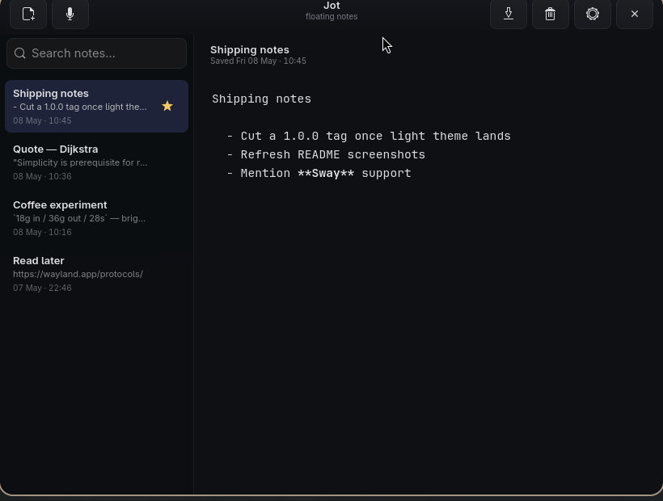

<div align="center">

# Jot

**Lightning-fast floating notes for tiling Wayland compositors.**

A tiny, native Rust + GTK 4 app that pops over whatever you're doing, eats one thought, and gets out of the way.



[Install](#install) · [Features](#features) · [Hyprland](#hyprland-integration) · [Voice](#voice-transcription) · [Keys](#keyboard-shortcuts) · [Develop](#development)

</div>

---

## Why

Existing note apps are heavy (Electron), tied to a vendor (Apple Notes), or behave poorly on tiling Wayland compositors — they open in their own workspace, refuse to float, won't sit on top. Jot is the smallest possible knife for a specific cut: **dump a thought *now*, find it later, never get in the way.**

Single binary. ~5 MB of RAM at rest. Instant startup. One keystroke up, one keystroke gone.

## Features

|  |  |  |
| :--- | :--- | :--- |
| **Floating, always-on-top** <br/> Pops over any app on any workspace. Translucent so you can still see what's behind. | **Native, fast, tiny** <br/> Rust + GTK 4 + libadwaita. Single binary, ~5 MB RAM, native Wayland. | **Auto-save everything** <br/> Debounced save on every keystroke. SQLite-backed, daily backups. |
| **Light & dark themes** <br/> Pick System / Light / Dark. Follows runtime flips of the desktop preference. | **Markdown rendering** <br/> Live-styles `**bold**`, `*italic*`, `# headings`, `` `code` ``, lists — without hiding the source. | **Search** <br/> Filter the sidebar by title and body content. `Ctrl+F` and start typing. |
| **Paste / drop images** <br/> `Ctrl+V` or drag from your file manager. Inline preview with click-to-zoom. | **Click-to-zoom canvas** <br/> Click any inline image. Drag to pan, `Ctrl+Scroll` to zoom anchored at the cursor. | **Voice transcription** <br/> Dictate with the mic. Powered by Groq Whisper Large v3 Turbo (~216× real-time). |
| **Pinned, tagged & colored notes** <br/> Pin to the top, group notes into sidebar tabs, and add color strips for fast scanning. | **Export as Markdown** <br/> Single note or bulk; bundles inline images into a sibling `images/` directory. | **Launcher-friendly** <br/> Desktop entry registered. Type "jot" in Walker, Rofi, GNOME Shell, etc. |
| **Copy blocks** <br/> Wrap reusable text in `{copy}...{/copy}` and Jot renders it with a one-click clipboard button. |  |  |

## Install

### Prebuilt release (Arch / any modern Linux x86_64)

```bash
sudo pacman -S --needed gtk4 libadwaita sqlite alsa-lib
curl -L -o jot.tar.gz https://github.com/Iann29/jot/releases/download/v1.5.0/jot-v1.5.0-x86_64-linux.tar.gz
tar -xzf jot.tar.gz && cd jot-v1.5.0-x86_64-linux && ./install.sh
```

Drops `jot` into `~/.local/bin`, the desktop entry into `~/.local/share/applications`, the icon into `~/.local/share/icons/hicolor/scalable/apps`. Make sure `~/.local/bin` is on your `PATH`.

### AUR (Arch)

```bash
yay -S jot-bin     # prebuilt binary
```

### From source

```bash
sudo pacman -S --needed gtk4 libadwaita sqlite alsa-lib rust
git clone https://github.com/Iann29/jot.git
cd jot && ./scripts/install.sh
```

## Hyprland integration

Jot ships with a window-rule snippet — floating, centered, pinned across workspaces, rounded — plus a global `Super+N` toggle keybind:

```bash
cp data/hyprland/jot.conf ~/.config/hypr/jot.conf
echo 'source = ~/.config/hypr/jot.conf' >> ~/.config/hypr/hyprland.conf
hyprctl reload
```

After that, **`Super+N`** toggles Jot from anywhere.

<details>
<summary><strong>What's in <code>jot.conf</code>?</strong></summary>

```
# Toggle Jot from anywhere
bind = SUPER, N, exec, pgrep -x jot >/dev/null && hyprctl dispatch focuswindow ^(com\.amageweb\.Jot)$ || jot

# Window rules — float, center, pin to all workspaces, give it a fixed size
windowrulev2 = float,        class:^(com\.amageweb\.Jot)$
windowrulev2 = center,       class:^(com\.amageweb\.Jot)$
windowrulev2 = pin,          class:^(com\.amageweb\.Jot)$
windowrulev2 = size 820 620, class:^(com\.amageweb\.Jot)$
windowrulev2 = rounding 14,  class:^(com\.amageweb\.Jot)$
```
</details>

<details>
<summary><strong>Sway / wlroots equivalent</strong></summary>

```
for_window [app_id="com.amageweb.Jot"] floating enable, sticky enable, resize set 820 620, move position center
bindsym $mod+n exec pgrep -x jot >/dev/null && swaymsg "[app_id=com.amageweb.Jot] focus" || jot
```
</details>

## Voice transcription

Jot can transcribe speech into the editor using **Groq Whisper Large v3 Turbo**. Free for low volumes ($0.04 / hour), and Groq runs Whisper at ~216× real-time, so a 15-second utterance is transcribed in well under a second.

**1.** Get a Groq API key at [console.groq.com/keys](https://console.groq.com/keys).

**2.** In Jot, open *Settings → Voice*, paste the key, click **Save**.

**3.** Click the mic in the header. Talk naturally — pauses between sentences become chunk boundaries. The text streams in chunk-by-chunk while you speak.

**4.** Click the mic again to stop. The final chunk flushes through; the editor goes back to "Saved …".

> The key is stored in plain text at `~/.config/jot/config.toml`. Audio is sent over TLS to Groq and is **not** stored on disk by Jot.

## GIF recording

Jot bundles a tiny screen-region recorder so you don't need Kooha for clips
to drop into chats and PRs. The mini-overlay is title-matched as
**Jot Recorder** so Hyprland can rule it independently of the main window.

**Setup (one-time)** — install the helpers:

```bash
sudo pacman -S --needed wf-recorder slurp ffmpeg wl-clipboard
```

**Use it:**

1. Press **`Super+R`** (or click the ● button next to the mic in the
   header).
2. Drag with `slurp` to pick a region — `Esc` cancels.
3. The mini-overlay appears bottom-right with the timer. Click **Stop**
   when you're done.
4. ffmpeg's two-pass palette pipeline converts the MP4 to a sharp,
   small GIF. The file lands in `~/Videos/gif/jot-YYYY-MM-DD-HHMMSS.gif`.
5. From the overlay you can **Save as…** elsewhere, **Copy** the GIF to
   the system clipboard (paste into Slack/Discord/web apps), open it in
   your default viewer, **Re-record**, or **Close**.

Defaults: **24 fps**, libx264 ultrafast capture → palette-aware GIF with
Sierra2_4a dithering. The Kooha-killer.

## Keyboard shortcuts

| Key                | Action                                |
| ------------------ | ------------------------------------- |
| `Super+N`          | Toggle window (Hyprland binding)      |
| `Super+R`          | Record a screen-region GIF            |
| `Ctrl+N`           | New note                              |
| `Ctrl+D`           | Delete current note (toast to undo)   |
| `Ctrl+F`           | Focus search                          |
| `Ctrl+Z`           | Undo (delete or text edits)           |
| `Ctrl+V`           | Paste (auto-detects images)           |
| `Ctrl+click URL`   | Open URL in default browser           |
| Drag image / `.md` | Inline (image) or new note (text)     |
| Click image        | Open in pan/zoom canvas               |
| `Ctrl+Scroll`      | Zoom in canvas (anchored at cursor)   |
| `Esc`              | Close zoom / hide window              |

The first non-image, non-empty line of every note becomes its title automatically. Notes are saved ~400 ms after your last keystroke.

Use the tag field above the editor to group notes into tabs in the sidebar. The color swatches next to it add a visible strip to each note row, including search results.

Reusable snippets can be written as:

```text
{copy}
message or command to copy
{/copy}
```

Once saved, the snippet renders as a copy block with a clipboard button while the raw text remains in the note for export and sync-safe storage.

## Where things live

```
~/.local/share/jot/notes.db          SQLite database (WAL mode)
~/.local/share/jot/images/           Pasted / dropped images
~/.local/share/jot/backups/          Daily snapshots (last 7)
~/Videos/gif/                        GIF recordings (one per session)
~/.config/jot/config.toml            Window size, opacity, theme, font, Groq API key
~/.local/share/applications/jot.desktop
~/.local/share/icons/hicolor/scalable/apps/jot.svg
~/.cache/jot-panic.log               Last panic message (if any)
```

## Development

```bash
cargo run                    # debug build
cargo run --release          # production build
RUST_LOG=jot=debug cargo run # verbose logs
cargo clippy --all-targets   # lint
cargo fmt                    # format
```

The interesting bits:

- `src/window.rs` — UI: header bar, sidebar list, editor, autosave, voice + image plumbing
- `src/db.rs` — SQLite layer (single connection, WAL mode, migrations)
- `src/app.rs` — single-instance toggle + GTK application setup
- `src/themes.rs` — light/dark CSS swap, follows the system color scheme
- `src/markdown_tags.rs` — single-pass scanner that applies `gtk::TextTag`s for bold/italic/code/headings/lists
- `src/transcribe.rs` — mic capture + VAD + Groq Whisper client
- `src/gif_recorder.rs` — slurp + wf-recorder + ffmpeg pipeline with subprocess RAII guards
- `src/recorder_window.rs` — mini overlay UI (Recording / Converting / Done)
- `src/image_canvas.rs` — pan/zoom image preview (single `WidgetImpl::snapshot`)
- `src/export.rs` — markdown export with image bundling
- `src/dark.css` / `src/light.css` — the look (rounded, glassy, transparent)

### Capturing screenshots & GIFs

The `scripts/` folder ships helpers for keeping README assets fresh:

```bash
scripts/capture-screenshot.sh hero --seed hero
scripts/record-gif.sh paste-image 8
```

The screenshot script backs up your real `notes.db` before swapping in a curated seed, and restores it on exit (or Ctrl+C).

## License

MIT — see [LICENSE](LICENSE).

## Acknowledgements

- [GTK 4](https://gtk.org/) and [libadwaita](https://gnome.pages.gitlab.gnome.org/libadwaita/) — the toolkit
- [Groq](https://groq.com/) — fast Whisper inference
- [cpal](https://github.com/RustAudio/cpal) — cross-platform audio capture
- [grim](https://sr.ht/~emersion/grim/) and [wf-recorder](https://github.com/ammen99/wf-recorder) — screen capture
- The Hyprland and Sway communities, for showing that a Linux desktop can feel good
