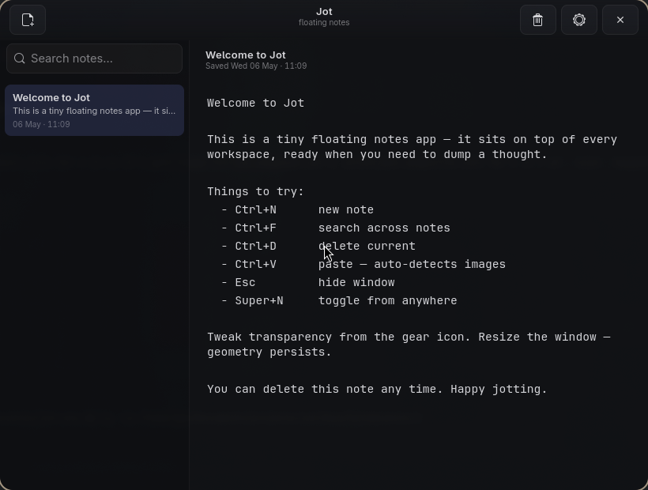

# Jot

> Lightning-fast floating notes for tiling Wayland compositors.




Jot is a tiny note-taking app built for the moment when something flashes by on
screen and you just need to **dump it somewhere**, fast — a quote from an
article, a snippet of code from a video, a thought before it slips. One
keystroke and a translucent floating window is on top of whatever you were
doing. Another keystroke and it's gone. No friction, no loading screens, no RAM
on fire.

Built natively in Rust with GTK 4 + libadwaita. Single binary, ~5 MB of RAM at
rest, instant startup. Works great with Hyprland and any compositor that
respects window rules.

## Highlights

- **Always-on-top floating window** — pops over any app, any workspace
- **Single binary, instant launch** — Rust + GTK 4, native Wayland
- **Adjustable transparency** — see what's behind while you take notes
- **Toggle keybind** — Super+N to show/hide (configurable)
- **Auto-save** — every keystroke, debounced. Never lose a thought
- **Search** — fuzzy-search across titles and bodies
- **Paste images** — Ctrl+V dumps clipboard images to disk and inlines them
- **SQLite-backed** — your notes live in `~/.local/share/jot/notes.db`
- **Open the launcher and type "jot"** — desktop entry registered, picked up by Walker, Rofi, GNOME Shell, etc.

## Install

### Prebuilt release (fastest — Arch / any modern Linux x86_64)

Make sure GTK 4 + libadwaita are present:

```bash
sudo pacman -S --needed gtk4 libadwaita sqlite
```

Grab the tarball from the [latest release](https://github.com/Iann29/jot/releases/latest) and run the installer:

```bash
curl -L -o jot.tar.gz https://github.com/Iann29/jot/releases/latest/download/jot-v0.1.0-x86_64-linux.tar.gz
tar -xzf jot.tar.gz
cd jot-v0.1.0-x86_64-linux
./install.sh
```

That drops `jot` into `~/.local/bin`, the desktop entry into `~/.local/share/applications`, and the icon into `~/.local/share/icons/hicolor/scalable/apps`. Make sure `~/.local/bin` is on your `PATH`.

### Build from source

If you want the bleeding edge:

```bash
sudo pacman -S --needed gtk4 libadwaita sqlite rust
git clone https://github.com/Iann29/jot.git
cd jot
./scripts/install.sh
```

### Hyprland integration

Jot ships with a Hyprland snippet that adds the keybind and window rules
(floating, centered, pinned, rounded):

```bash
cp data/hyprland/jot.conf ~/.config/hypr/jot.conf
echo 'source = ~/.config/hypr/jot.conf' >> ~/.config/hypr/hyprland.conf
hyprctl reload
```

After that, **Super+N** toggles Jot from anywhere.

## Usage

| Key | Action |
| --- | --- |
| `Super+N` | Toggle window (Hyprland binding) |
| `Ctrl+N` | New note |
| `Ctrl+D` | Delete current note |
| `Ctrl+F` | Focus search |
| `Ctrl+V` | Paste (auto-detects images) |
| `Esc` | Hide window |

The first line of every note becomes its title automatically. Notes are saved
~400 ms after your last keystroke. Tweak window opacity from the gear menu.

## Where things live

```
~/.local/share/jot/notes.db        SQLite database
~/.local/share/jot/images/         Pasted images
~/.config/jot/config.toml          Window size, opacity, font size
```

Delete those to start fresh.

## Development

```bash
cargo run                  # debug build
cargo run --release        # production build
RUST_LOG=debug cargo run   # verbose logs
```

The whole app is ~1k lines of Rust. The interesting bits:

- `src/window.rs` — the UI: header bar, sidebar list, editor, autosave
- `src/db.rs` — SQLite layer (single connection, WAL mode)
- `src/app.rs` — single-instance toggle + GTK application setup
- `src/style.css` — the look (rounded, glassy, dark)

## Why does this exist?

Existing note apps are heavy (Electron), tied to a vendor (Apple Notes), or
behave poorly on tiling Wayland compositors (open in their own workspace,
don't float, can't sit on top). Jot is the smallest possible knife for a
specific cut: dump a thought *now*, find it later, never get in the way.

## License

MIT — see [LICENSE](LICENSE).
